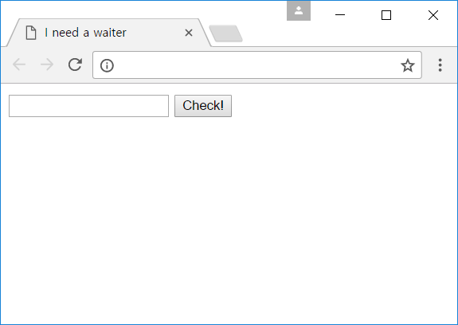
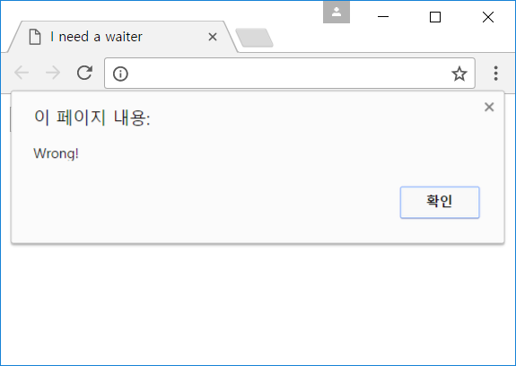
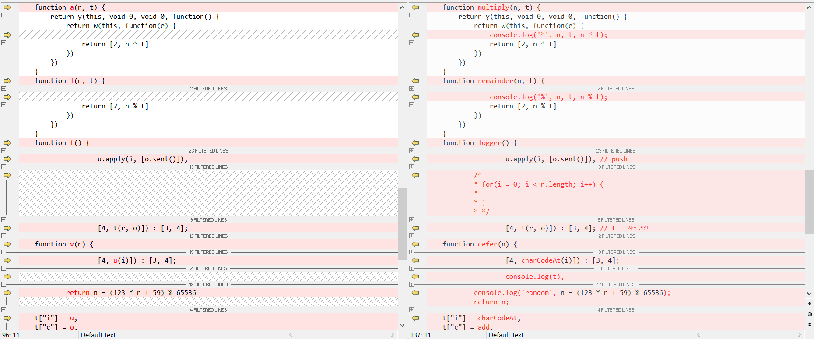

# Need a waiter
It was a simple web program like below:



When wrong password is entered, it says Wrong!



It seemed like a functional language concept with Promise resolve/reject/throw+catch. Because the script is really long, I added some helper code to trace some operations.

```js
console.error = ()=> {}
Array.prototype.push = function(x) {
    var index;
    console.log('push', this);
    if(this.length == 0)
        console.log(new Error().stack);
    index = this.length++;
    this['_' + index] = x;
 
    this.__defineGetter__(index, function() {
        var value = this['_' + index];
        console.log('array[' + index + '] =', value);
        return value;
    })
    return x;
}
 
// ABCDEFGHIJKLMNOPQRSTUVWXYZ
 
function Hooker(label) {
    hooker = {
        get: function(obj, item) {
            console.log(label + '[' + item + ']');
            if(item == 15) console.log(new Error().stack);
            return obj[item];
        }
    }
    return hooker;
}
 
function hooked(s, label) {
    if(!label) label = 'n';
    return new Proxy(new String(s), Hooker(label));
}
```

First I added Proxy instead of a string to track the usage of the string(which was key), and added logger for some operation methods like this:



Then I was enable to track the operations of variable related with my input. It was 16byte block cipher with permutation + lcg (seed from input sum + fixed value), and the ciphertext has last byte as seed value.

`./waiter_trace.txt` and `./watier_trace2.txt` is the trace generated by the script.

`INeedaWaiter_original` is original(but js was formatted) files, and `INeedaWaiter_with_trace` is patched files.

`./waiter.py` is encryption + decryption routine for the specified key. The variable t is ciphertext, and in this case I set it as the ciphertext of the password. So it prints the flag.

