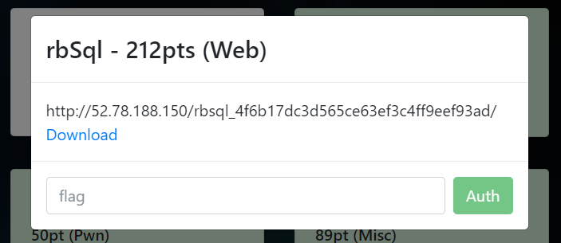
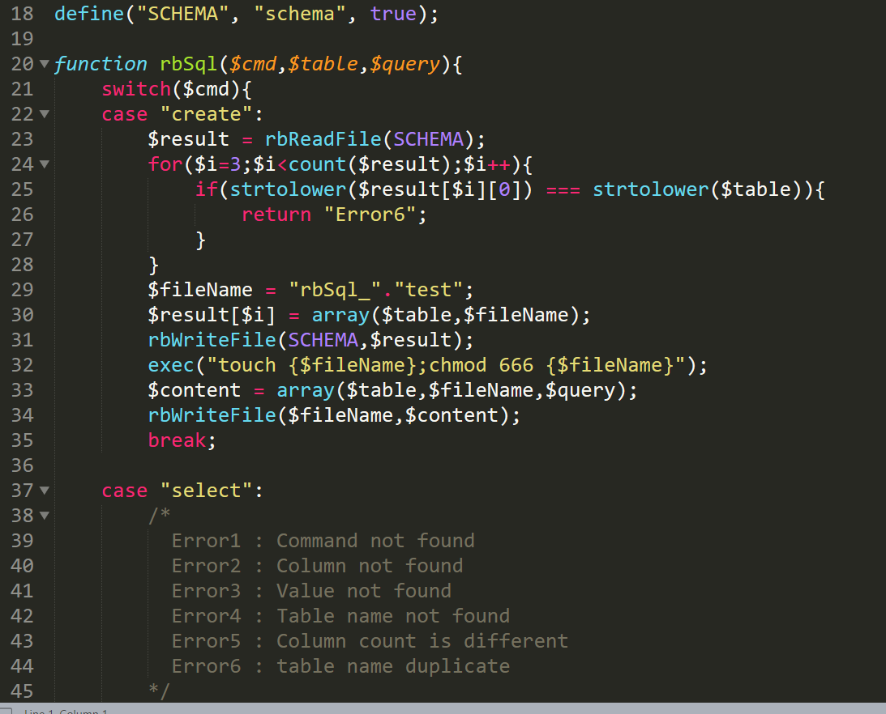
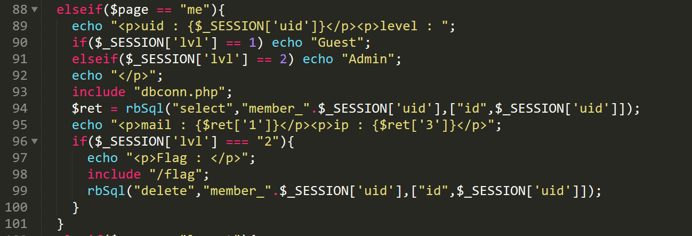
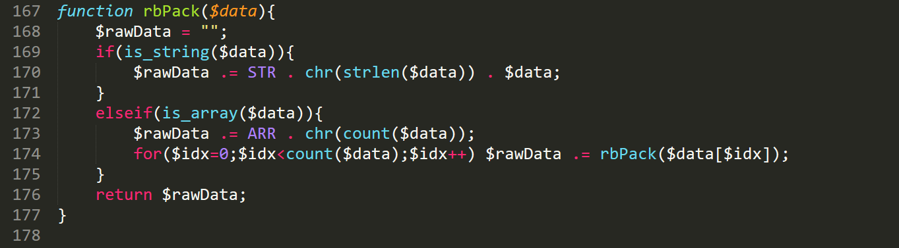

rbSql 212pt (Web)



웹페이지, 그리고 소스코드가 주어졌다. 소스코드를 살펴보니 index.php에서 login/register 등이 구현되어있고 dbconn.php에서 CRUD operation을 직접 만든 serialize/unserialize 루틴으로 구현해놓았다.



플래그는 `$page == “me”`인 경우 세션값의 lvl이 2면 출력한다.



그리고 취약점은 아래와 같다. 일단 가입 처리부분을 보자. index.php의 join_chk 처리루틴에 있다.


여기서 $umail은 최대 256바이트까지 입력 가능하다. 하지만 현 serialize 형식에서 문자열을 저장할 때는 문자열 길이에 chr를 적용하여 저장한다.



따라서 `chr(256) == chr(0) == ‘\x00’`이므로, 이메일을 256바이트로 적었을 경우 0바이트짜리 문자열로 인식되고 실제 입력된 이메일은 그 다음에 올 형식 문자열 및 내용으로 파싱이 진행되게 된다.

아래와 같이 페이로드를 만들어서 가입시켰다.

```
uid=<아이디>&umail=%21+c4ca4238a0b923820dcc509a6f75849b%00%01aa%012%01%E1Caaaaaaaaaaaaaaaaaaaaaaaaaaaaaaaaaaaaaaaaaaaaaaaaaaaaaaaaaaaaaaaaaaaaaaaaaaaaaaaaaaaaaaaaaaaaaaaaaaaaaaaaaaaaaaaaaaaaaaaaaaaaaaaaaaaaaaaaaaaaaaaaaaaaaaaaaaaaaaaaaaaaaaaaaaaaaaaaaaaaaaaaaaaaaaaaaaaaaaaaaaaaaaaaaaaaa&upw=anything
```

패스워드는 md5 후 비교되기때문에 md5로 만들어서 넣어줬고, 레벨은 1바이트 문자열인 2로 만들어줬다.

c4ca4238a0b923820dcc509a6f75849b는 “1”에 해당하는 md5값이기 때문에 위에서 지정한 아이디를 넣고 비밀번호를 1로 넣으면 로그인이 되며, 세션의 lvl값은 2로 된다. 따라서 플래그가 출력된다.
