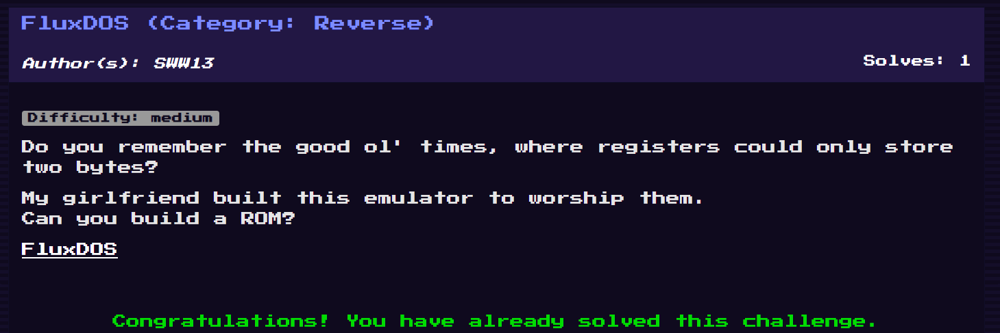
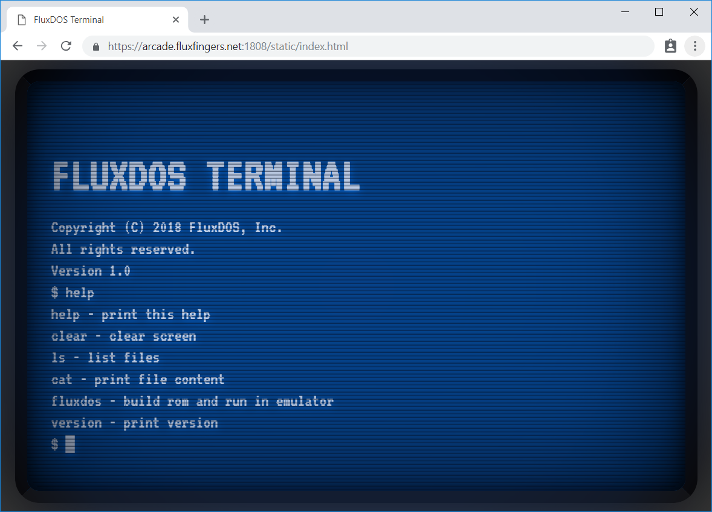
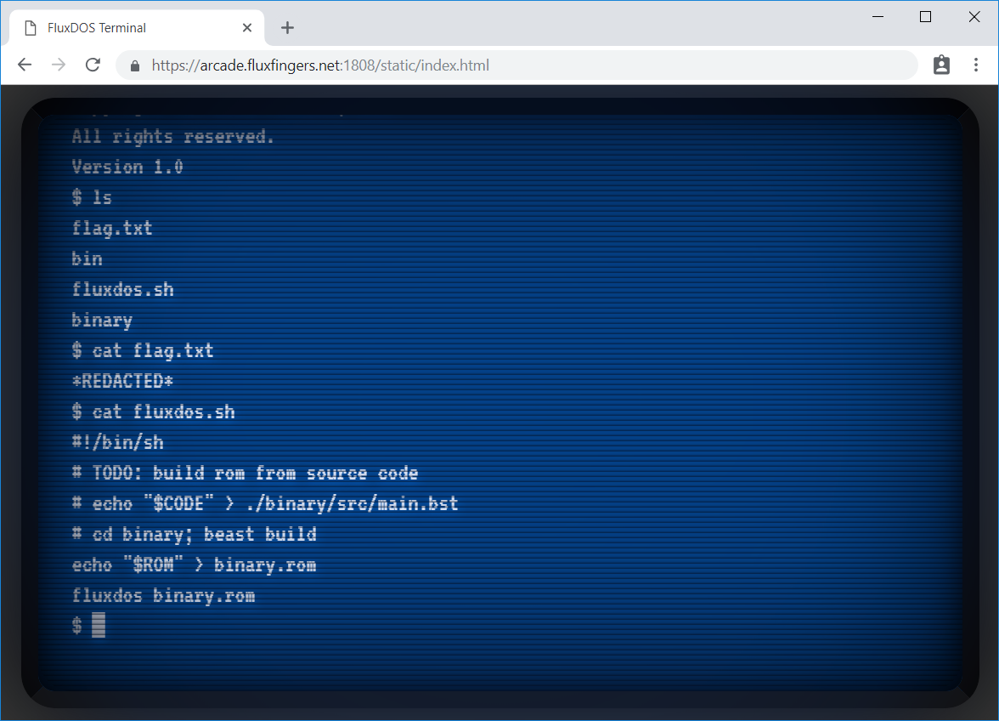
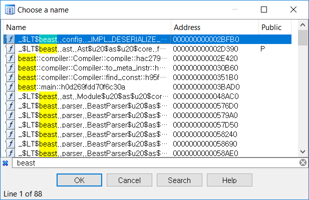
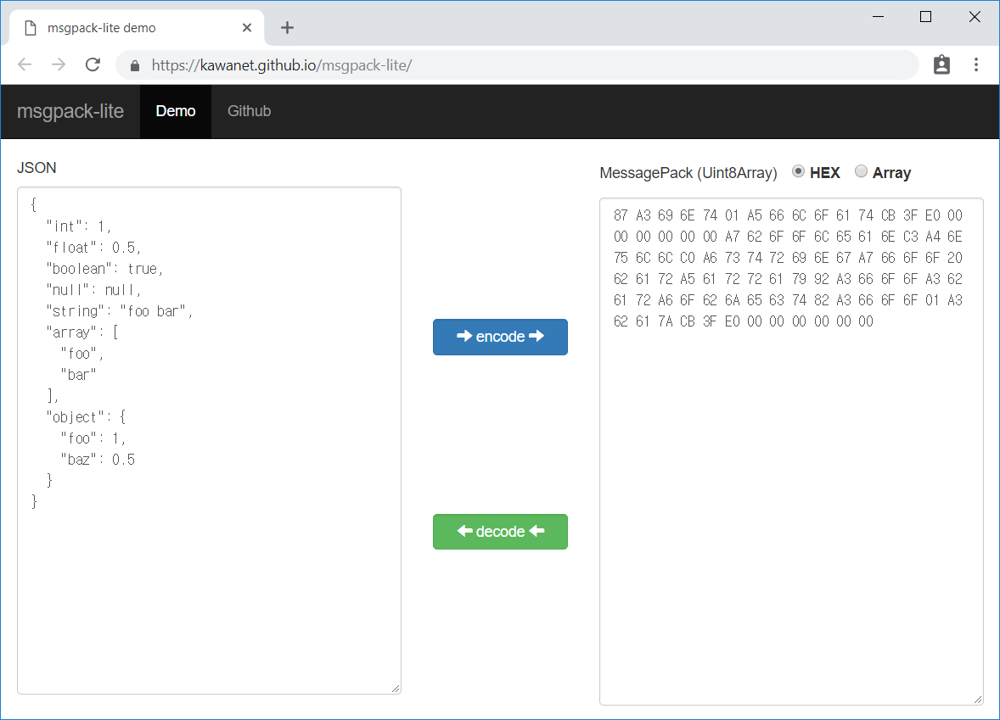
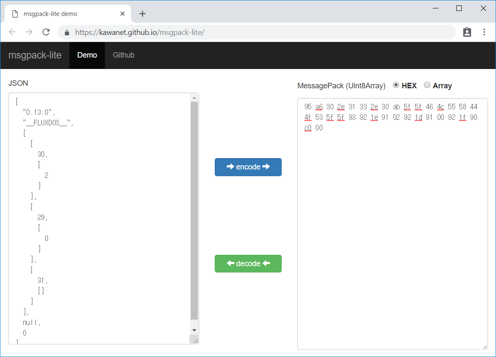

# FluxDOS



```
Do you remember the good ol' times, where registers could only store two bytes?

My girlfriend built this emulator to worship them.
Can you build a ROM?

[FluxDOS](https://arcade.fluxfingers.net:1808/)
```

A 1990s'style terminal-like website is given, which emulates few commands including help:



```shell
$ help
help - print this help
clear - clear screen
ls - list files
cat - print file content
fluxdos - build rom and run in emulator
version - print version
```

With `fluxdos` command, I could upload a fluxdos ROM file and execute it in the server. Another interesting point is, it even has an assembler named **beast**. Let's `ls` and `cat rusty.sh`.



Yeah, flag.txt got redacted. Regardless of whether it's commented out, I could download both the emulator and the assembler. In fact, `cat <file>` == `/static/cat/<file>`. Let's just download the file from [these](https://arcade.fluxfingers.net:1808/static/cat/bin/beast) [URLs](https://arcade.fluxfingers.net:1808/static/cat/bin/fluxdos). You can find these binaries in this github folder too.


## Beast Assembler

As mentioned above (see screenshot), there's sample source code at `./binary/src/main.bst`.

```
(func $main
  (call $hello_world)
)
;; write "Hello world" to stdout
(func $hello_world
  ;; TODO: implement hello world
)
```

Now we know that `call` mnemonic exists! Hooray! ... making me analyze the assembler binary. It has symbols, and compiled by rust. (You can usually find `rust` string if it's powered by rust)



At this point I googled `rust Compiler "beast"`. Somehow it worked, leading me to [bakerVM/beast](https://github.com/bakervm/beast) repository. Yeah, it had source code.

There were [sample codes](https://github.com/bakervm/beast/tree/master/test/src) using all of beast instructions, including `load/store`, `push/pop`, and suspicious `(sys :nuke)` mnemonic. It was indeed a syscall function. And `:nuke` is mapped to a number on `Beast.toml`.


## FluxDOS

(*Spoiler: no symbols for fluxdos.rs; it's even stripped*)

Considering the flow `src/main.bst -> target/binary.rom -> fluxdos`, it's really an emulator for the beast-compiled ROM.

Before that, let's talk about how beast ROM is composed.

```
00000000: 1f8b 0800 0000 0000 00ff 0122 00dd ff95  ..........."....
00000010: a630 2e31 332e 30ab 5f5f 464c 5558 444f  .0.13.0.__FLUXDO
00000020: 535f 5f93 921e 9102 921d 9100 921f 90c0  S__.............
00000030: 0061 dc79 ad22 0000 00                   .a.y."...
```

I tried to modify a bytes, and `fluxdos <file>` emitted an error.

```
thread 'main' panicked at 'Loading ROM failed: Custom { kind: InvalidInput, error: StringError("corrupt gzip stream does not have a matching checksum") }', libcore/result.rs:945:5
note: Run with `RUST_BACKTRACE=1` for a backtrace.
```

Cool! Now we know that whole file is compressed with gzip starts with `1f 8b 08 00`. Let's decompress it.

```
00000000: 95a6 302e 3133 2e30 ab5f 5f46 4c55 5844  ..0.13.0.__FLUXD
00000010: 4f53 5f5f 9392 1e91 0292 1d91 0092 1f90  OS__............
00000020: c000                                     ..
```

Before we get further, let's see beast's binary-encoder source code. [Compiler::compile](https://github.com/bakervm/beast/blob/master/src/compiler.rs#L26) emits [melon::Program](https://github.com/bakervm/melon/blob/master/src/program.rs#L52) class, and it finally emits gzipped msgpack buffer. Okay, I googled `msgpack decoder` and it was auto-filled with `online`. Online decoder, the coolest!



Now we know what to do.



After compiling `(sys :nuke)` with nuke = 1337, I could see `[29, [1337] ]`. So we can guess the opcode handler for 29 (0x1D) processes syscall.

Then I analyzed fluxdos too. This time, since `__FLUXDOS__` string is given, I guessed that maybe it's checked before execution. Yes. What a guess-driven reverse engineering, but it kinda works.

<sub>(In fact I first brute forced syscall by modifying the binary directly, but I stopped it after 17000. It was too slow)</sub>

```c
// 0x555555554000
// .rodata:000055555566875F aFluxdos db '__FLUXDOS__' ; DATA XREF: ROMParse+1D2↑o
// ... (After making struct after decompilation)

/*
00000000 rom             struc ; (sizeof=0x4C, mappedto_43)
00000000 version         string ?
00000018 signature       string ?
00000030 vector          string ?
00000048 field_48        db ?
00000049 field_49        db ?
0000004A field_4A        db ?
0000004B field_4B        db ?
0000004C rom             ends

Considering the msgpack structure above, it makes sense
: array with version, signature, and instruction vectors, ...
*/
  if ( v4->signature.n != 11
    || (v21 = (char *)v4->signature.buf, v21 != aFluxdos) && (v8 = aFluxdos, memcmp(v21, aFluxdos, 0xBuLL)) )
  {
    string::from_ptr((string *)&instrs, aFluxdos, 0xBuLL);

...
  if ( v4->version.n != 6
    || (char *)v4->version.buf != "0.13.0miniz.c"
    && *(_DWORD *)v4->version.buf ^ '31.0' | *(unsigned __int16 *)(v4->version.buf + 4) ^ '0.' )

// Knowing ->vector has instructions, I xref-ed v4->vector in the same function.
// Then I set hardware breakpoint to v4->vector.buf which contained mnemonic, args.
  buffer = v4->vector.buf;
...
// Breakpoint 1 triggered on Instruction::decoder. Array into int32_t..
  for ( i = Instruction::decoder(instrs.m256i_i64); (_BYTE)i != 41; i = Instruction::decoder(instrs.m256i_i64) )
    v33[v35++] = i;
// After some HW breakpoints... I could find multiple switch-cases for all mnemonics
// Including 0x1D: sys too.
      case 0x1D:                                // syscall
        if ( WORD1(instruction) )               // which is sysno too
        {
          v26 = (__int64 (__fastcall **)())syscall_handler(v338, (__int64)decoded_instructions, sysno);
          if ( v26 )
          {
// syscall_handler: 0000555555561A30
__int64 __fastcall syscall_handler(__int64 a1, __int64 stack, int sysno)
{
  switch ( (signed __int16)sysno + 210LL )
  // signed __int16 with 210? It means sysno - 0xFF2E
  {
    case 0LL: ...

```

Yeah, we found that sysno starts with 0xFF2E. Before this, I traced open64 with only 1 xrefs to find where the ROM file is opened, and found this:

```c
// .text:00005555555F2A80
__int64 __fastcall file::open(string *a1, string *buf, __int64 size, fileOptions *a4)
```

And... Xrefs-to existed on syscall_handler. I tried the syscall `(0xFF2E + 180)` with no arguments. Fortunately, it panicked.


```
$ cat src/main.bst
(func $main
  (sys :open) ;; open = 65506
)

$ fluxdos target/binary.rom
thread 'main' panicked at 'cannot pop a value off an empty stack', src/main.rs:254:29
note: Run with `RUST_BACKTRACE=1` for a backtrace.
```

Great, now we can try pushing integers until it normally executes. The syscall 180 had 2 arguments: path and mode. mode == 0xFFFF then it opens writable file stream, 0xFFFE then readable file stream. `fd = open(path, mode)` required. fd is pushed after file open.

After reversing I found another syscall: 168 for `read(fd, buf, len)`. However, I couldn't find write system call. Oh... I found that. 162. Sorry, but I didn't find it during CTF.

Then we can get the flag.txt.


p.s.

I looped through buffers with `read(flag[i / 8] >> (i % 8) & 1)`, like a blind SQLi. The result code is printed to the console, so I could use it. However, we have write system call.

